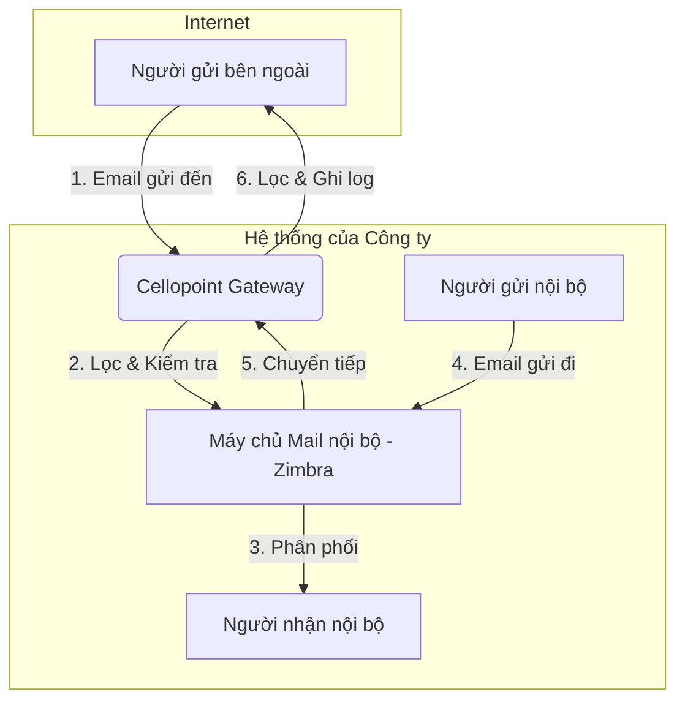
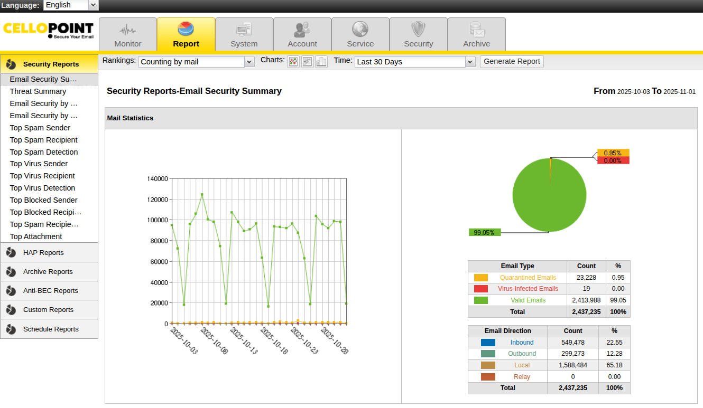

# 📖 HƯỚNG DẪN TOÀN DIỆN VỀ QUẢN LÝ VÀ XỬ LÝ SỰ CỐ EMAIL TRÊN HỆ THỐNG CELLOPOINT

---

## Lời Mở Đầu

Tài liệu này cung cấp một cái nhìn chi tiết và toàn diện về hệ thống Email Gateway Cellopoint, từ các khái niệm cơ bản đến những kỹ thuật xử lý sự cố nâng cao. Mục tiêu của tài liệu là trang bị cho đội ngũ Quản trị viên hệ thống, Nhân viên hỗ trợ kỹ thuật (Support) và các bên liên quan những kiến thức cần thiết để vận hành, giám sát và đảm bảo luồng giao tiếp email của tổ chức luôn thông suốt, an toàn và hiệu quả.

---

## 1. TỔNG QUAN VỀ HỆ THỐNG EMAIL GATEWAY CELLOPOINT

### 1.1. Cellopoint là gì?
**Cellopoint** là một nền tảng quản lý và giám sát hệ thống email chuyên nghiệp, hoạt động như một **gateway** (cổng kết nối) trung gian giữa máy chủ email nội bộ (ví dụ: Zimbra, Microsoft Exchange) và Internet. Hệ thống này được thiết kế để cung cấp một lớp bảo vệ toàn diện, khả năng kiểm soát mạnh mẽ và công cụ quản trị chi tiết đối với toàn bộ luồng email ra/vào của tổ chức.

### 1.2. Tại sao Doanh nghiệp cần Email Gateway?
Trong môi trường số hiện nay, email là phương tiện giao tiếp trọng yếu nhưng cũng là nguồn gốc của nhiều rủi ro an ninh mạng. Email Gateway ra đời để giải quyết các thách thức này:
*   **Phòng thủ tuyến đầu:** Ngăn chặn các mối đe dọa như virus, mã độc tống tiền (ransomware), lừa đảo (phishing), và email giả mạo (spoofing) *trước khi* chúng có cơ hội xâm nhập vào mạng nội bộ.
*   **Giảm tải cho Mail Server:** Việc lọc và xử lý một lượng lớn email spam và độc hại giúp giảm tải đáng kể cho máy chủ email chính, tối ưu hóa hiệu suất và tài nguyên.
*   **Thực thi chính sách tập trung:** Cho phép áp đặt các chính sách bảo mật, kiểm soát nội dung và lưu trữ email một cách nhất quán cho toàn bộ tổ chức tại một điểm duy nhất.

### 1.3. Vai trò và lợi ích chính của Cellopoint
Cellopoint đóng vai trò then chốt trong việc đảm bảo an toàn, hiệu quả và tính tuân thủ cho hệ thống email của công ty:
*   **Bảo mật đa lớp:** Lọc bỏ spam, virus, mã độc, phishing và các cuộc tấn công email tinh vi khác.
*   **Giám sát và Truy vết (Tracking):** Cung cấp khả năng theo dõi chi tiết hành trình của từng email, giúp quản trị viên có cái nhìn tổng quan và nhanh chóng chẩn đoán sự cố.
*   **Ghi log chi tiết:** Lưu trữ nhật ký đầy đủ cho mỗi email, là bằng chứng quan trọng cho việc điều tra, kiểm toán hoặc giải quyết tranh chấp.
*   **Xử lý lỗi linh hoạt:** Cho phép quản trị viên chủ động gửi lại (resend) hoặc chuyển tiếp (forward) email khi gặp lỗi, đảm bảo thông tin liên lạc không bị gián đoạn.
*   **Cách ly email nghi ngờ (Quarantine):** Tự động cô lập các email đáng ngờ, cho phép quản trị viên hoặc người dùng cuối (tùy cấu hình) xem xét và xử lý an toàn.

### 1.4. Sơ đồ luồng email chi tiết qua Cellopoint

*   **Luồng nhận vào (Incoming):** `Internet → Cellopoint → Mail Server nội bộ`
    1.  Cellopoint nhận email từ Internet.
    2.  Hệ thống thực hiện quét virus, lọc spam, kiểm tra chính sách bảo mật.
    3.  Nếu an toàn, email được chuyển tiếp vào máy chủ Zimbra để giao đến hộp thư người nhận. Nếu vi phạm, email sẽ bị chặn hoặc cách ly.

*   **Luồng gửi đi (Outgoing):** `Mail Server nội bộ → Cellopoint → Internet`
    1.  Người dùng nội bộ gửi email.
    2.  Máy chủ Zimbra chuyển email đến Cellopoint.
    3.  Cellopoint kiểm tra nội dung (nếu có chính sách), ghi log và gửi email ra Internet.

> 📘 **Lưu ý quan trọng:** Mọi thao tác kiểm tra, xử lý và gửi lại email đều được thực hiện trên giao diện quản lý của Cellopoint. Đây là điểm quản lý tập trung cho toàn bộ luồng email.

---

## 2. HƯỚNG DẪN TRUY CẬP VÀ SỬ DỤNG

### 2.1. Quy trình đăng nhập
1.  **Truy cập đường dẫn:** Mở trình duyệt web và truy cập địa chỉ:
    🔗 [https://cello.pyv.com.vn](https://gateway.pyv.com.vn)
2.  **Nhập thông tin đăng nhập:** Sử dụng tài khoản được cấp phát (ví dụ: **Admin**, **Support**).
3.  **Xác nhận:** Nhấn nút "Login" để truy cập hệ thống.

### 2.2. Tổng quan giao diện người dùng
*   **Menu điều hướng:** Thường nằm bên trái, chứa các mục chức năng chính như `Mail`, `Report`, `System`, `Policy`.
*   **Bảng điều khiển (Dashboard):** Hiển thị thống kê nhanh về lưu lượng email, các mối đe dọa, và trạng thái hệ thống.
*   **Khu vực làm việc chính:** Hiển thị chi tiết chức năng được chọn.

> 
> *Hình ảnh minh họa giao diện đăng nhập và tổng quan hệ thống Cellopoint.*

---

## 3. CHỨC NĂNG THEO DÕI VÀ TRUY VẾT EMAIL (MAIL TRACKING)

Đây là công cụ quan trọng nhất để chẩn đoán các vấn đề liên quan đến email.

### 3.1. Truy cập chức năng Mail Tracking
Từ menu chính, điều hướng đến: **Mail → Tracking / Log**.

### 3.2. Sử dụng bộ lọc để tìm kiếm email hiệu quả

| Trường tìm kiếm | Mô tả chi tiết | Ví dụ minh họa |
|:----------------|:---------------|:---------------|
| **Sender**      | Địa chỉ email người gửi. | `user@pyv.com.vn` |
| **Recipient**   | Địa chỉ email người nhận. | `customer@domain.com` |
| **Subject**     | Tiêu đề email (có thể tìm kiếm một phần). | `Báo giá`, `Hợp đồng` |
| **Status**      | Trạng thái email: `delivered` (thành công), `failed` (thất bại), `deferred` (tạm hoãn), `quarantined` (cách ly). | `failed` |
| **Date Range**  | Khoảng thời gian tìm kiếm. | `Hôm nay`, `Tuần trước` |
| **Message ID**  | Mã định danh duy nhất của email, cách tìm chính xác nhất. | `<xyz.123@mail.pyv.com.vn>` |
| **Queue ID**    | Mã định danh của email trong hàng đợi của Cellopoint. | `A1B2C3D4E5F6` |

### 3.3. Mẹo tìm kiếm nâng cao
*   **Kết hợp nhiều bộ lọc:** Tìm email từ `user@pyv.com.vn` gửi đến `customer@domain.com` với trạng thái `failed` trong tuần trước.
*   **Sử dụng ký tự đại diện:** Một số hệ thống cho phép dùng `*` (ví dụ: `*@pyv.com.vn` để tìm tất cả email từ tên miền này).
*   **Tìm theo IP:** Sử dụng trường `Client IP` hoặc `Server IP` để truy vết nguồn gốc hoặc đích đến của kết nối.

### 3.4. Phân tích chi tiết thông tin email (View Detail)
Click vào một email và chọn **View Detail** để xem:
*   **Thông tin cơ bản:** Người gửi, người nhận, tiêu đề.
*   **Thông tin kỹ thuật:** Máy chủ trung chuyển (Relay / Host), địa chỉ IP.
*   **Trạng thái và thời gian:** Status, Delivery time.
*   **Thông báo lỗi (Error Message):** **Đây là thông tin quan trọng nhất** để xác định nguyên nhân sự cố.

> 
> *Hình ảnh minh họa giao diện tìm kiếm và xem chi tiết email.*

---

## 4. QUẢN LÝ EMAIL BỊ CÁCH LY (QUARANTINE)

### 4.1. Truy cập giao diện Quarantine
Từ menu chính, điều hướng đến: **Mail → Quarantine**.

### 4.2. Tìm hiểu các lý do email bị cách ly
Mỗi email bị cách ly đều có một lý do cụ thể. Hiểu rõ các lý do này giúp bạn đưa ra quyết định xử lý chính xác:

| Lý do (Reason) | Giải thích |
|:---------------|:------------|
| **Spam**       | Email bị hệ thống đánh giá là thư rác dựa trên nội dung, người gửi, hoặc các quy tắc khác. |
| **Virus**      | Email chứa tệp đính kèm hoặc liên kết bị phát hiện là virus hoặc mã độc. |
| **Blacklist**  | Địa chỉ IP của máy chủ gửi nằm trong danh sách đen (Real-time Blackhole List - RBL). |
| **Content Filter** | Email vi phạm một chính sách về nội dung do quản trị viên thiết lập (ví dụ: chứa từ khóa cấm, tệp đính kèm không được phép). |
| **Phishing**   | Email bị nhận dạng là một nỗ lực lừa đảo nhằm đánh cắp thông tin nhạy cảm. |

### 4.3. Hướng dẫn xử lý email bị cách ly

*   **View (Xem):** Xem trước nội dung email một cách an toàn (các liên kết và mã độc đã bị vô hiệu hóa).
*   **Release (Giải phóng):** Gửi email đến hộp thư của người nhận. **Chỉ thực hiện khi chắc chắn 100% email là an toàn.**
*   **Delete (Xóa):** Xóa vĩnh viễn email khỏi hệ thống.
*   **Forward (Chuyển tiếp):** Gửi email đến một địa chỉ khác (ví dụ: gửi cho bộ phận IT để phân tích thêm).
*   **Resend (Gửi lại):** Tương tự như Release, gửi lại email cho người nhận ban đầu.

### 4.4. Thực hành tốt nhất khi xử lý Quarantine
*   **Không bao giờ Release email không rõ nguồn gốc:** Đặc biệt là các email có tệp đính kèm lạ (`.zip`, `.exe`, `.js`) hoặc các email yêu cầu đăng nhập, cung cấp thông tin cá nhân.
*   **Whitelist người gửi tin cậy:** Nếu một đối tác quan trọng thường xuyên bị đưa vào Quarantine, hãy xem xét thêm địa chỉ email hoặc tên miền của họ vào "danh sách trắng" (Whitelist).
*   **Báo cáo cho quản trị viên:** Nếu phát hiện một loại email lừa đảo mới, hãy báo cáo để quản trị viên cập nhật bộ lọc cho toàn hệ thống.

> ⚠️ **Cảnh báo an toàn:** Việc giải phóng một email độc hại có thể gây ra hậu quả nghiêm trọng như lây nhiễm mã độc, mất mát dữ liệu hoặc tài chính. Luôn tuân thủ nguyên tắc "thà chặn nhầm còn hơn bỏ sót".

> 
> *Hình ảnh minh họa giao diện quản lý email bị cách ly.*

---

## 5. PHÂN TÍCH VÀ XỬ LÝ SỰ CỐ GỬI/NHẬN EMAIL

### 5.1. Phân loại mã lỗi SMTP: Tạm thời và Vĩnh viễn

*   **Lỗi tạm thời (Mã `4xx`):**
    *   **Ý nghĩa:** Sự cố tạm thời, hệ thống sẽ tự động thử gửi lại.
    *   **Hành động:** Có thể chờ hoặc chủ động **Resend** để thử lại ngay.
    *   **Ví dụ:** `421 Service not available`, `451 Greylisting in action`.

*   **Lỗi vĩnh viễn (Mã `5xx`):**
    *   **Ý nghĩa:** Lỗi không thể tự khắc phục. Việc gửi lại sẽ tiếp tục thất bại.
    *   **Hành động:** Cần **phân tích nguyên nhân và khắc phục** (ví dụ: sửa lại địa chỉ email, kiểm tra cấu hình).
    *   **Ví dụ:** `550 User unknown`, `554 Transaction failed`.

### 5.2. Bảng tra cứu lỗi thường gặp và cách khắc phục

| Mã lỗi / Thông báo | Nguyên nhân phổ biến | Hướng xử lý |
|:-------------------|:----------------------|:-------------|
| `550 5.1.1 User unknown` | Sai địa chỉ email người nhận; tài khoản không tồn tại. | Kiểm tra lại chính tả địa chỉ email. Liên hệ người nhận để xác nhận. |
| `554 5.7.1 Rejected as spam` | IP người gửi bị blacklist; nội dung bị đánh dấu spam. | Kiểm tra IP trên các trang như `mxtoolbox.com`. Yêu cầu người nhận whitelist địa chỉ của bạn. |
| `451 4.4.1 Timeout` | Máy chủ đích không phản hồi; lỗi kết nối mạng. | Thử **Resend** sau vài phút. Kiểm tra kết nối mạng. |
| `Connection refused` | Firewall của máy chủ đích chặn kết nối; cổng SMTP bị đóng. | Liên hệ quản trị viên của người nhận để kiểm tra firewall. |
| `Message quarantined` | Email vi phạm chính sách bảo mật của Cellopoint. | Truy cập giao diện **Quarantine** để kiểm tra và xử lý. |
| `Mailbox full` | Hộp thư của người nhận đã đầy. | Thông báo cho người nhận để dọn dẹp hộp thư. Thử gửi lại sau. |
| `Host not found` / `Domain not found` | Sai tên miền của người nhận; lỗi DNS. | Kiểm tra lại tên miền trong địa chỉ email (phần sau ký tự `@`). |

### 5.3. Quy trình xử lý sự cố từng bước
**Tình huống: Người dùng báo cáo không nhận được email từ đối tác `sender@example.com`**

1.  **Thu thập thông tin:** Hỏi người dùng về địa chỉ email người gửi, người nhận, tiêu đề (nếu có), và thời gian gửi ước tính.
2.  **Kiểm tra trên Mail Tracking:**
    *   Vào **Mail → Tracking**.
    *   Trong ô **Sender**, nhập `sender@example.com`.
    *   Trong ô **Recipient**, nhập địa chỉ email của người dùng.
    *   Chọn khoảng thời gian phù hợp.
    *   Nhấn **Search**.
3.  **Phân tích kết quả:**
    *   **Trường hợp 1: Tìm thấy email với trạng thái `delivered`:** Email đã được chuyển thành công đến máy chủ Zimbra. Vấn đề có thể nằm ở phía sau (ví dụ: email bị chuyển vào mục Spam của người dùng, hoặc do các quy tắc lọc trên Outlook/Zimbra). Hướng dẫn người dùng kiểm tra thư mục Spam/Junk.
    *   **Trường hợp 2: Tìm thấy email với trạng thái `quarantined`:** Email đã bị cách ly. Chuyển sang giao diện **Quarantine**, tìm email và xử lý (Release nếu an toàn).
    *   **Trường hợp 3: Tìm thấy email với trạng thái `failed` hoặc `deferred`:** Click **View Detail** để xem **Error Message**. Dựa vào mã lỗi trong bảng trên để xác định nguyên nhân và hướng xử lý.
    *   **Trường hợp 4: Không tìm thấy email nào:** Điều này có nghĩa là email chưa bao giờ đến được hệ thống Cellopoint. Nguyên nhân có thể do:
        *   Người gửi gõ sai địa chỉ email.
        *   Hệ thống của người gửi đang gặp sự cố.
        *   Email bị chặn bởi một hệ thống khác trước khi đến Cellopoint.
        *   **Hành động:** Yêu cầu người gửi kiểm tra lại và thử gửi lại.

### 5.4. Hướng dẫn gửi lại email (Resend)
*   **Từ giao diện Quarantine:** Chọn email cần gửi và nhấn nút **Resend**.
*   **Từ giao diện Mail Tracking:** Một số hệ thống cho phép gửi lại trực tiếp từ log đối với các email bị lỗi. Chọn email và tìm tùy chọn **Resend**.

> 
> *Hình ảnh minh họa thao tác Resend email.*

---

## 6. KIỂM TRA VÀ XÁC NHẬN SAU KHI XỬ LÝ

### 6.1. Các bước kiểm tra
Sau khi thực hiện thao tác `Resend` hoặc `Release`:
1.  Quay lại giao diện **Mail Tracking**.
2.  Sử dụng `Message ID` hoặc thông tin người gửi/người nhận để tìm lại email đó.
3.  **Xác nhận trạng thái đã chuyển thành `delivered`**. Một log mới cho hành động gửi lại sẽ được tạo ra.
4.  Nếu trạng thái vẫn là `failed`, hãy xem chi tiết log mới để tìm hiểu lý do thất bại lần này. Nguyên nhân gốc rễ có thể chưa được giải quyết.

### 6.2. Khi nào cần leo thang xử lý?
Nếu bạn đã thực hiện các bước trên nhưng vẫn không thể giải quyết vấn đề, hãy leo thang xử lý cho quản trị viên cấp cao hơn, cung cấp đầy đủ các thông tin sau:
*   `Message ID` của email.
*   Thông báo lỗi chi tiết đã ghi nhận.
*   Các bước bạn đã thực hiện để khắc phục.

---

## 7. BÁO CÁO VÀ THỐNG KÊ (REPORTING)

### 7.1. Tầm quan trọng của báo cáo
Chức năng báo cáo giúp bạn có cái nhìn tổng quan về:
*   Lưu lượng email ra/vào.
*   Các loại mối đe dọa bị chặn nhiều nhất.
*   Những người dùng gửi/nhận email nhiều nhất.
*   Tình trạng sức khỏe của hệ thống.

### 7.2. Các loại báo cáo phổ biến
*   **Traffic Report:** Báo cáo lưu lượng email theo giờ, ngày, tuần.
*   **Spam/Virus Report:** Thống kê số lượng spam và virus đã bị chặn.
*   **Top Senders/Recipients:** Liệt kê những tài khoản gửi/nhận nhiều email nhất.

### 7.3. Hướng dẫn tạo và xem báo cáo cơ bản
1.  Điều hướng đến menu **Report**.
2.  Chọn loại báo cáo bạn muốn xem (ví dụ: `Mail Traffic`).
3.  Chọn khoảng thời gian và các tiêu chí khác (nếu có).
4.  Nhấn **Generate** hoặc **View** để xem kết quả.

> 
> *Hình ảnh minh họa giao diện báo cáo và thống kê.*

---

## 8. PHỤ LỤC: CÂU HỎI THƯỜNG GẶP (FAQ)

**1. Tôi có thể tự kiểm tra email của mình trên Cellopoint không?**
*   Thông thường, chỉ có tài khoản quản trị viên hoặc hỗ trợ kỹ thuật mới có quyền truy cập vào Cellopoint. Người dùng cuối nên liên hệ bộ phận IT khi có sự cố.

**2. Tại sao một email hợp lệ từ đối tác lại bị đưa vào Quarantine?**
*   Có nhiều lý do: email có thể chứa các từ khóa nhạy cảm, đường link bị hệ thống đánh giá là đáng ngờ, hoặc máy chủ của đối tác tạm thời bị liệt vào blacklist. Hãy kiểm tra lý do trong giao diện Quarantine và cân nhắc whitelist nếu cần.

**3. "Release" và "Resend" trong Quarantine khác nhau như thế nào?**
*   Về cơ bản, cả hai hành động đều nhằm mục đích gửi email đến người nhận. `Release` là thuật ngữ chung cho việc "thả" email ra khỏi khu vực cách ly. `Resend` nhấn mạnh hành động "gửi lại". Trong hầu hết các trường hợp, chức năng của chúng là tương đương.

**4. Mất bao lâu để hệ thống tự động gửi lại email bị lỗi tạm thời (mã 4xx)?**
*   Thời gian này phụ thuộc vào cấu hình của hệ thống, nhưng thường là sau mỗi 15-30 phút, và hệ thống sẽ thử lại nhiều lần trong vài giờ hoặc thậm chí vài ngày trước khi từ bỏ và báo lỗi vĩnh viễn.
