# 📧 HƯỚNG DẪN KIỂM TRA VÀ XỬ LÝ EMAIL TRÊN HỆ THỐNG CELLOPOINT

---

## 1. GIỚI THIỆU VỀ HỆ THỐNG CELLOPOINT

### 1.1. Cellopoint là gì?
**Cellopoint** là một nền tảng quản lý và giám sát hệ thống email chuyên nghiệp, hoạt động như một **gateway** trung gian giữa máy chủ email nội bộ (ví dụ: Zimbra) và Internet. Hệ thống này được thiết kế để cung cấp một lớp bảo vệ toàn diện và khả năng kiểm soát mạnh mẽ đối với luồng email ra/vào của tổ chức.

### 1.2. Vai trò và lợi ích của Cellopoint
Cellopoint đóng vai trò quan trọng trong việc đảm bảo an toàn và hiệu quả cho hệ thống email của công ty, với các lợi ích chính sau:
*   **Bảo mật nâng cao:** Lọc bỏ các mối đe dọa như spam, virus, mã độc, phishing và các cuộc tấn công email khác trước khi chúng tiếp cận hộp thư người dùng.
*   **Giám sát và theo dõi:** Cung cấp khả năng theo dõi chi tiết luồng email ra/vào, giúp quản trị viên có cái nhìn tổng quan về tình hình trao đổi email.
*   **Ghi log chi tiết:** Ghi lại nhật ký đầy đủ cho từng email, bao gồm thông tin người gửi, người nhận, tiêu đề, trạng thái và thời gian, hỗ trợ đắc lực cho việc tra cứu và kiểm tra khi có sự cố.
*   **Xử lý lỗi linh hoạt:** Cho phép quản trị viên thực hiện các thao tác như gửi lại (resend) hoặc chuyển tiếp (forward) email khi gặp lỗi tạm thời, đảm bảo email được gửi đến đích.
*   **Cách ly email nghi ngờ (Quarantine):** Tự động cách ly các email bị đánh dấu là spam, virus hoặc có nội dung đáng ngờ, cho phép người dùng hoặc quản trị viên kiểm tra và phục hồi thủ công nếu cần.

### 1.3. Sơ đồ luồng email qua Cellopoint

Dưới đây là sơ đồ mô tả chi tiết luồng email khi đi qua hệ thống Cellopoint:

```mermaid
graph TD
    A[Người gửi - Internet] --> B(Cellopoint Gateway);
    B --> C[Máy chủ Mail nội bộ - Zimbra];
    C --> D[Người nhận nội bộ];

    C --> B;
    B --> A;
```

*   **Luồng gửi đi (Outgoing Mail Flow):**
    `Máy chủ Mail nội bộ (Zimbra) → Cellopoint Gateway → Internet`
    Trong luồng này, Cellopoint chịu trách nhiệm kiểm tra nội dung, ghi log và đảm bảo email được gửi ra ngoài một cách an toàn và chính xác.

*   **Luồng nhận vào (Incoming Mail Flow):**
    `Internet → Cellopoint Gateway → Máy chủ Mail nội bộ (Zimbra)`
    Cellopoint thực hiện kiểm tra an ninh, lọc spam/virus và các mối đe dọa khác, sau đó chuyển tiếp email đã được xác minh vào hộp thư nội bộ của người nhận.

> 📘 **Lưu ý quan trọng:** Mọi thao tác kiểm tra log, quản lý email cách ly, hoặc gửi lại email đều được thực hiện trực tiếp trên giao diện quản lý của Cellopoint. Người dùng hoặc quản trị viên không cần truy cập trực tiếp vào máy chủ Zimbra để thực hiện các tác vụ này.

---

## 2. QUY TRÌNH ĐĂNG NHẬP VÀ GIAO DIỆN CHÍNH

### 2.1. Hướng dẫn đăng nhập
Để bắt đầu sử dụng hệ thống Cellopoint, vui lòng thực hiện các bước sau:
1.  **Truy cập đường dẫn:** Mở trình duyệt web và truy cập vào địa chỉ:
    🔗 [https://cello.pyv.com.vn](https://gateway.pyv.com.vn)
2.  **Nhập thông tin đăng nhập:** Sử dụng tài khoản được cấp phát với các quyền hạn phù hợp (ví dụ: **Admin**, **Support**, hoặc **Mail Operator**).
    *   **Username:** [Tên đăng nhập của bạn]
    *   **Password:** [Mật khẩu của bạn]
3.  **Xác nhận:** Nhấn nút "Login" hoặc "Đăng nhập" để truy cập vào hệ thống.

### 2.2. Tổng quan giao diện người dùng
Sau khi đăng nhập thành công, bạn sẽ thấy giao diện chính của Cellopoint. Giao diện này thường bao gồm các phần chính sau:
*   **Menu điều hướng:** Nằm ở phía bên trái hoặc trên cùng, chứa các mục chức năng như Mail, Report, System, Policy, v.v.
*   **Bảng điều khiển (Dashboard):** Hiển thị tổng quan về tình hình email, các thống kê quan trọng, và cảnh báo.
*   **Khu vực làm việc chính:** Nơi hiển thị chi tiết các chức năng bạn chọn từ menu (ví dụ: danh sách email trong Mail Tracking, email bị cách ly trong Quarantine).

> 
> *Hình ảnh minh họa giao diện đăng nhập và tổng quan hệ thống Cellopoint.*

---

## 3. KIỂM TRA VÀ THEO DÕI EMAIL (MAIL TRACKING)

Chức năng Mail Tracking (hay Mail Log) cho phép bạn tìm kiếm, xem và phân tích chi tiết tất cả các email đã đi qua hệ thống Cellopoint.

### 3.1. Truy cập chức năng Mail Tracking
1.  Từ giao diện chính, điều hướng đến menu: **Mail → Tracking / Log**.
2.  Giao diện Mail Tracking sẽ hiển thị, liệt kê danh sách các email gần đây nhất theo thời gian.

### 3.2. Các tiêu chí tìm kiếm và lọc email hiệu quả
Để tìm kiếm một email cụ thể hoặc một nhóm email, bạn có thể sử dụng các tiêu chí lọc sau:

| Trường tìm kiếm | Mô tả chi tiết | Ví dụ minh họa |
|:----------------|:---------------|:---------------|
| **Sender**      | Địa chỉ email của người gửi. | `user@pyv.com.vn`, `admin@example.com` |
| **Recipient**   | Địa chỉ email của người nhận. | `customer@domain.com`, `support@another.org` |
| **Subject**     | Tiêu đề của email. Có thể tìm kiếm một phần tiêu đề. | `PO#12345`, `Báo cáo tháng 10` |
| **Status**      | Trạng thái gửi/nhận của email. Các trạng thái phổ biến: `delivered` (đã gửi thành công), `failed` (gửi thất bại), `deferred` (tạm hoãn), `quarantined` (đã cách ly). | `delivered`, `failed` |
| **Date Range**  | Khoảng thời gian gửi/nhận email. Bạn có thể chọn ngày bắt đầu và ngày kết thúc. | `2025-10-15 ~ 2025-10-18`, `Hôm nay`, `Tuần trước` |
| **Message ID**  | Mã định danh duy nhất của một email. Đây là cách chính xác nhất để tìm một email cụ thể. | `<abcde12345@mail.pyv.com.vn>` |
| **Queue ID**    | Mã định danh của email trong hàng đợi xử lý của Cellopoint. | `A1B2C3D4E5F6` |

> 💡 **Mẹo tìm kiếm nhanh:**
> Khi bạn có `Message ID` hoặc `Queue ID` của một email, hãy dán trực tiếp vào ô tìm kiếm chính để tra cứu nhanh chóng và chính xác nhất.

### 3.3. Phân tích chi tiết thông tin email (View Detail)
Sau khi tìm thấy email cần kiểm tra, bạn có thể xem thông tin chi tiết bằng cách:
1.  Click vào dòng email trong danh sách kết quả.
2.  Chọn nút **View Detail** (hoặc biểu tượng tương ứng).

Màn hình chi tiết email sẽ hiển thị các thông tin quan trọng sau:
*   **Thông tin cơ bản:** Sender (Người gửi), Recipient (Người nhận), Subject (Tiêu đề), Message ID.
*   **Thông tin kỹ thuật:** Máy chủ trung chuyển (Relay / Host), địa chỉ IP nguồn/đích.
*   **Trạng thái gửi:** Status (Trạng thái cuối cùng), Delivery time (Thời gian gửi/nhận).
*   **Lý do lỗi:** Error Message (Nếu email gặp lỗi, thông báo lỗi chi tiết sẽ hiển thị tại đây).

> 
> *Hình ảnh minh họa giao diện tìm kiếm và xem chi tiết email trong Mail Tracking.*

---

## 4. XỬ LÝ EMAIL BỊ CÁCH LY (QUARANTINE)

Chức năng Quarantine là nơi Cellopoint giữ lại các email bị nghi ngờ là spam, virus, hoặc có chứa nội dung độc hại, không cho phép chúng đến thẳng hộp thư người nhận.

### 4.1. Truy cập giao diện Quarantine
1.  Từ giao diện chính, điều hướng đến menu: **Mail → Quarantine**.
2.  Giao diện Quarantine sẽ hiển thị danh sách các email đang bị cách ly.

### 4.2. Các cột thông tin chính và ý nghĩa
Trong giao diện Quarantine, bạn sẽ thấy các cột thông tin sau:

| Cột thông tin | Ý nghĩa |
|:--------------|:--------|
| **Sender**    | Địa chỉ email của người gửi. |
| **Recipient** | Địa chỉ email của người nhận. |
| **Reason**    | Lý do email bị cách ly (ví dụ: Spam, Virus, Blacklist, Content Filter). |
| **Date**      | Ngày và giờ email được nhận và cách ly. |
| **Action**    | Các thao tác bạn có thể thực hiện với email này (View, Release, Delete, Forward, Resend). |

### 4.3. Hướng dẫn các thao tác xử lý email bị cách ly
Bạn có thể thực hiện các thao tác sau với email bị cách ly:

*   **View (Xem nội dung):**
    *   Cho phép bạn xem trước nội dung của email.
    *   **Lưu ý:** Hệ thống sẽ tự động ẩn hoặc vô hiệu hóa các phần có khả năng gây nguy hiểm (ví dụ: liên kết đáng ngờ, mã script) để đảm bảo an toàn.
    *   Chỉ xem để xác định email có phải là hợp lệ hay không.

*   **Release (Giải phóng):**
    *   Chuyển email đã bị cách ly đến hộp thư của người nhận ban đầu.
    *   Sử dụng khi bạn đã xác minh email là hợp lệ và an toàn.

*   **Delete (Xóa vĩnh viễn):**
    *   Xóa email bị nghi ngờ khỏi hệ thống Cellopoint một cách vĩnh viễn.
    *   Sử dụng khi bạn chắc chắn email là spam, virus hoặc không mong muốn.

*   **Forward (Chuyển tiếp):**
    *   Chuyển tiếp email bị cách ly đến một địa chỉ email khác mà bạn chỉ định.
    *   Hữu ích khi bạn muốn gửi email này cho một bộ phận khác để kiểm tra hoặc lưu trữ.

*   **Resend (Gửi lại):**
    *   Gửi lại email bị cách ly đến người nhận ban đầu.
    *   Thường được sử dụng khi email bị cách ly do lỗi cấu hình tạm thời hoặc khi bạn muốn đảm bảo email được gửi lại mà không cần thay đổi người nhận.

> ⚠️ **Cảnh báo an toàn:**
> Chỉ nên thực hiện thao tác **Release** hoặc **Resend** khi bạn đã **xác minh kỹ lưỡng nội dung email là an toàn và hợp lệ**. Việc giải phóng email độc hại có thể gây rủi ro cho hệ thống và người dùng.

> 
> *Hình ảnh minh họa giao diện quản lý email bị cách ly (Quarantine).*

---

## 5. PHÂN TÍCH VÀ XỬ LÝ LỖI GỬI/NHẬN EMAIL

Khi email không được gửi hoặc nhận thành công, hệ thống Cellopoint sẽ ghi lại các mã lỗi và thông báo chi tiết. Việc hiểu rõ các mã lỗi này giúp bạn nhanh chóng xác định nguyên nhân và đưa ra hướng xử lý phù hợp.

### 5.1. Các mã lỗi phổ biến và ý nghĩa

Các mã lỗi SMTP (Simple Mail Transfer Protocol) thường được chia thành hai loại chính:

*   **Lỗi tạm thời (Mã bắt đầu bằng `4xx`):**
    *   Đây là các lỗi không vĩnh viễn, thường do sự cố tạm thời trên máy chủ gửi, máy chủ nhận, hoặc đường truyền mạng.
    *   Hệ thống sẽ tự động thử lại việc gửi email sau một khoảng thời gian.
    *   Bạn có thể thực hiện thao tác **Resend** để thử gửi lại ngay lập tức.
    *   **Ví dụ:** `421 Service not available`, `451 Requested action aborted: local error in processing`.

*   **Lỗi vĩnh viễn (Mã bắt đầu bằng `5xx`):**
    *   Đây là các lỗi không thể khắc phục bằng cách thử lại. Email sẽ không bao giờ được gửi thành công nếu không có sự can thiệp.
    *   Cần phải kiểm tra lại thông tin người gửi/người nhận, cấu hình hệ thống, hoặc nội dung email.
    *   **Ví dụ:** `550 User unknown`, `554 Transaction failed`.

### 5.2. Nguyên nhân thường gặp và cách khắc phục

Dưới đây là bảng tổng hợp các mã lỗi, mô tả, nguyên nhân phổ biến và hướng xử lý:

| Mã lỗi / Thông báo | Mô tả | Nguyên nhân phổ biến | Hướng xử lý |
|:-------------------|:------|:----------------------|:-------------|
| `550 5.1.1 User unknown` | Địa chỉ người nhận không tồn tại trên máy chủ đích. | Sai địa chỉ email người nhận, tài khoản đã bị xóa hoặc không hoạt động. | Kiểm tra lại chính tả địa chỉ email người nhận. Liên hệ người nhận để xác nhận. |
| `554 5.7.1 Rejected as spam` | Email bị máy chủ nhận từ chối do bị đánh dấu là spam. | Địa chỉ IP của người gửi bị liệt vào danh sách đen (blacklist), nội dung email chứa từ khóa spam, hoặc điểm số spam cao. | Kiểm tra IP người gửi có bị blacklist không. Điều chỉnh nội dung email. Yêu cầu người nhận thêm địa chỉ của bạn vào whitelist. |
| `451 4.4.1 Timeout` | Máy chủ đích không phản hồi trong thời gian quy định. | Lỗi kết nối Internet tạm thời, máy chủ nhận quá tải, lỗi DNS. | Thử gửi lại (resend) sau vài phút. Kiểm tra kết nối mạng và cấu hình DNS. |
| `421 4.3.2 Service not available` | Máy chủ SMTP đích tạm thời không khả dụng hoặc đang bảo trì. | Máy chủ nhận đang gặp sự cố, quá tải. | Chờ 5-10 phút và thử gửi lại (resend). |
| `Connection refused` | Máy chủ Cellopoint không thể thiết lập kết nối với máy chủ đích. | Firewall của máy chủ đích chặn kết nối, cổng SMTP (25 hoặc 587) bị chặn. | Kiểm tra cấu hình firewall và đảm bảo các cổng SMTP cần thiết được mở. |
| `Message quarantined` | Email bị hệ thống Cellopoint cách ly. | Hệ thống nghi ngờ email chứa spam, virus, hoặc vi phạm chính sách bảo mật. | Truy cập giao diện Quarantine để kiểm tra, xem xét và xử lý (Release/Delete/Forward/Resend). |
| `Mailbox full` | Hộp thư của người nhận đã đầy, không thể nhận thêm email. | Người nhận không dọn dẹp hộp thư. | Thông báo cho người nhận để giải phóng dung lượng hộp thư. Thử gửi lại sau. |
| `Host not found` | Không tìm thấy máy chủ email của người nhận. | Lỗi DNS, tên miền người nhận không tồn tại hoặc sai chính tả. | Kiểm tra lại tên miền của người nhận. |

> 🧠 **Ghi nhớ nguyên tắc xử lý lỗi:**
> *   **Mã `4xx` (lỗi tạm thời):** Thường có thể khắc phục bằng cách **Resend** sau một khoảng thời gian.
> *   **Mã `5xx` (lỗi vĩnh viễn):** Yêu cầu **kiểm tra và chỉnh sửa** thông tin hoặc cấu hình trước khi gửi lại.

### 5.3. Hướng dẫn gửi lại email (Resend)

Bạn có thể gửi lại email đã bị lỗi hoặc bị cách ly thông qua hai cách chính:

#### Gửi lại từ giao diện Quarantine (Đối với email `quarantined`)
1.  **Truy cập Quarantine:** Mở menu **Mail → Quarantine**.
2.  **Tìm kiếm email:** Chọn email bị cách ly mà bạn muốn gửi lại.
3.  **Thực hiện Resend:** Nhấn nút **Resend** (hoặc chọn từ menu Action).
4.  **Xác nhận:** Hệ thống sẽ gửi lại email đến người nhận ban đầu.

> 
> *Hình ảnh minh họa thao tác Resend email từ giao diện Mail Log hoặc Quarantine.*

---

## ✅ 6. Kiểm tra kết quả sau khi resend

1. Quay lại **Mail Log**
2. Tìm lại bằng `Message ID` hoặc `Recipient`
3. Đảm bảo trạng thái đã đổi sang `delivered`
4. Nếu vẫn lỗi → kiểm tra lại phần **Error Log*